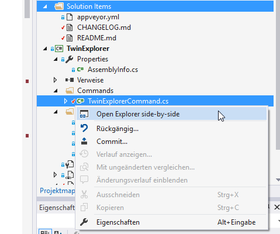

# TwinExplorer

<!-- Replace this badge with your own-->

<!-- Update the VS Gallery link after you upload the VSIX-->
Download this extension from the [VS Gallery](https://visualstudiogallery.msdn.microsoft.com/2319d00f-5810-49f9-b6e4-57ac3ce28988)
or get the [CI build]('http://vsixgallery.com/extension/7e7f1316-08bb-4871-851a-4fd82d9d4d32/').

---------------------------------------

TwinExplorer opens two Explorer windows side by side 
at the selected files location from the context menu of Solution Explorer.
Twin Explorer kills previous instances of Explorer 
in order to avoid cluttering the desktop, 
if there are more than 5 Explorer instances already running.

See the [changelog](CHANGELOG.md) for changes and roadmap.

## Features

- Open two Explorer windows side by side
  - Select two files, open Explorer at their locations
  - Select one file, open Explorer twice at its location
- Kill previous Explorer instances, keeping at max. 5

### Select two files, open Explorer at their locations
Select two files in Solution Explorer and right-click.

Click the command 'Open Explorer side-by-side' in order to open Explorer
twice at the locations of the two files.

### Select one file, open Explorer twice at its location
Select one file in Solution Explorer and right-click. Click the command 'Open Explorer side-by-side' in order to open Explorer
twice at the location of the single selected file.

### Kill previous Explorer instances
In order to avoid cluttering the desktop with two many open Explorer windows, 
the tool kills previous Explorer windows, while keeping at most five instances.

### Known Issue
The context menu is only provided for Solution Explorer. Sometimes,
another context menu has a higher priority and will superseed TwinExplorer.

For example, folders have their own context menu which superseeds TwinExplorer.

## Contribute
Check out the [contribution guidelines](CONTRIBUTING.md)
if you want to contribute to this project.

For cloning and building this project yourself, make sure
to install the
[Extensibility Tools 2015](https://visualstudiogallery.msdn.microsoft.com/ab39a092-1343-46e2-b0f1-6a3f91155aa6)
extension for Visual Studio which enables some features
used by this project.

## License
[Apache 2.0](LICENSE)